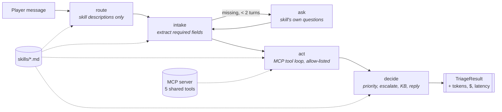

# skills-support-agent

[](https://github.com/RahulBruh/skills-support-agent/actions/workflows/ci.yml)

A **plug-and-play player-support triage agent**. Each support domain (billing, account recovery, bug reports, connectivity) is a declarative `SKILL.md` file that defines its intake questions, business rules, escalation policy and persona. Adding or changing a skill changes the agent's behaviour **without touching code**.

Built with **LangGraph + Claude**. Ticket, account, purchase, knowledge-base and service-status lookups are **MCP tools** shared by every skill. Accuracy and cost are measured by the companion repo **[agent-eval-harness](https://github.com/RahulBruh/agent-eval-harness)**.

> **Planning first.** Requirements were written and committed before any code: [BRD](docs/BRD.md) · [User stories](docs/user-stories.md) · [Workflow maps](docs/workflow-map.md) · [Design decisions](docs/decisions.md) · [Backlog (GitHub Issues)](https://github.com/RahulBruh/skills-support-agent/issues?q=is%3Aissue) · [Milestones](https://github.com/RahulBruh/skills-support-agent/milestones?state=closed)

## Results

From [eval run 2026-10-03](https://github.com/RahulBruh/agent-eval-harness/tree/main/results/2026-10-03-baseline) on 53 labeled cases with Claude Haiku 4.5:

| | before: verbose skills, all inlined | after: concise skills, progressive loading |
|---|---|---|
| Decision accuracy (95% CI) | 86.8% (75–93) | 92.5% (82–97) |
| Tokens per task | 26,468 | **7,400 (−72%)** |
| Cost per task | $0.0292 | **$0.0102 (−65%)** |
| p50 latency | 8.7s | 9.2s |

**Extensibility:** the connectivity domain was added in [a4aa6fc](https://github.com/RahulBruh/skills-support-agent/commit/a4aa6fc): `1 file changed, 25 insertions(+)`, all in `skills/connectivity/SKILL.md`, with no Python changes.

See the harness README for the ablation, the routing regression the evals caught, and the limitations.

## How it works



The graph in [`graph.py`](src/support_agent/graph.py) contains **no domain knowledge**; all of it comes from the active skill:

| Skill field | Used by | Effect |
|---|---|---|
| `description` | router | The only skill text the router sees (progressive disclosure) |
| `required_fields` + `intake_questions` | intake / ask | What to extract; missing fields are asked verbatim |
| `allowed_tools` | act | Allow-list over the shared MCP tools, enforced by the engine |
| `escalation_rules`, `priority_rules`, body | decide | Business policy for the decision |
| `persona` | decide | Tone of the player reply |

A skill, abridged ([full file](skills/account-recovery/SKILL.md)):

```markdown
---
name: account-recovery
description: Can't log in, forgotten password, lost 2FA device, hacked or compromised account, ...
persona: Reassuring account-security specialist. Treats every compromise report as urgent.
required_fields: [account_id, platform, recovery_issue]
intake_questions:
  account_id: What's the email or account ID on the account (e.g. ACC-1234)?
  ...
allowed_tools: [get_account_status, search_kb, lookup_ticket]
escalation_rules:
  - Any sign of compromise (hacked, unrecognized login, email/password changed without the player) → escalate to Security.
  - Lost 2FA device with no backup codes → escalate for identity verification.
priority_rules:
  P1: Compromise or suspected takeover.
  ...
---
## Rules
- Look up the account. If `flags` include `login_from_new_country` ..., treat as compromise even if the player is unsure.
```

## Quickstart

```bash
uv sync
export ANTHROPIC_API_KEY=...            # an org-level key also needs ANTHROPIC_WORKSPACE_ID

uv run support-agent skills list        # what's loaded
uv run support-agent skills validate    # schema + tool allow-list checks
uv run support-agent chat               # interactive triage
uv run support-agent run "I was charged twice for 1000 Shards" \
    --followup "maya.r@example.com, PC, Sept 28" --json
```

Example output (real run):

```
Agent: Your purchase history shows two identical charges for 1000 Shards on Sept 28
(orders ORD-50011 and ORD-50012, both $9.99). I'm escalating this to our billing team...
───────────────────────────── Triage ─────────────────────────────
skill     billing (confidence 0.95)
priority  P2
escalate  True (Duplicate charge confirmed in purchase history)
tools     get_purchase_history
usage     7674 in / 723 out, 5 calls, $0.0113, 8.9s
```

**Use the MCP server elsewhere.** `python -m support_agent.mcp_server` speaks MCP over stdio, so Claude Desktop, Claude Code or any MCP client can use the same five tools: `lookup_ticket`, `get_account_status`, `get_purchase_history`, `search_kb` and `get_service_status`.

**Benchmark modes.** `--skills-dir skills_v1` loads the verbose "before" skills, and `--context-mode inline_all` puts every skill into every prompt (the naive baseline).

## Adding a domain

Follow the [playbook](docs/adding-a-skill.md). In short: create `skills/<name>/SKILL.md`, run `skills validate`, and add eval cases in the harness. Opening a PR then triggers the [eval gate](.github/workflows/evals.yml), which runs the smoke set and fails if accuracy drops or tokens per task grow beyond tolerance against [`baselines/smoke-baseline.json`](baselines/smoke-baseline.json).

## Project layout

```
docs/             BRD, user stories, workflow maps, playbook, ADRs
skills/           the four production skills (v2, concise)
skills_v1/        verbose first-draft skills, kept as the benchmark baseline
data/             mock accounts, purchases, tickets, service status, KB articles
src/support_agent/
  skills.py       SKILL.md parser + pydantic schema validation
  graph.py        LangGraph engine (domain-agnostic)
  mcp_server.py   FastMCP server exposing the shared tools
  api.py          SupportAgent / run_triage (used by the CLI and the harness)
  llm.py          Claude wrapper with per-run token and cost accounting
tests/            unit tests with a scripted fake LLM + a real MCP stdio integration test
```

All games, the publisher ("Nimbus Games") and the player data are fictional.
