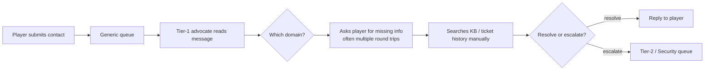
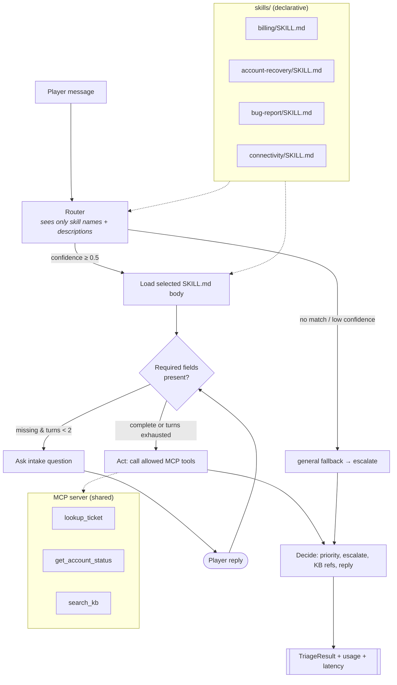
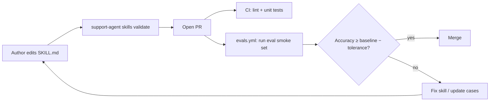

# Workflow Map

## Current state (manual triage)

Pain points: domain knowledge lives in people's heads and wikis, intake is inconsistent, and the time to first meaningful response is long.

## Future state (skills-driven agent)

## Change-management flow (skill authoring)

