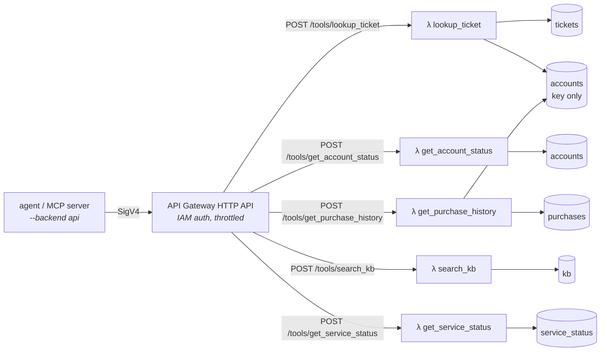

# AWS deployment

One CDK stack (`stack.py`) deploys the tool services:



- **DynamoDB:** five on-demand tables, one per entity, keyed by access pattern ([ADR-7](../docs/decisions.md)).
- **Lambda:** one function per tool, all built from the same package code. `TOOL` picks the tool, and each function has **its own IAM role** generated from [`access.py`](../src/support_agent/aws/access.py) ([ADR-8](../docs/decisions.md)).
- **API Gateway:** an HTTP API whose routes use the IAM authorizer. The `ClientPolicyArn` output grants `execute-api:Invoke` on these routes and nothing else.

## Monitoring

`monitoring.py` adds a CloudWatch dashboard (`<prefix>-operations`) and alarms that notify an SNS topic. Pass `-c alarm_email=you@example.com` on deploy to subscribe an email address.

| Scope | Source | Alarms |
|---|---|---|
| Each **skill** (discovered from `skills/` at synth time) | `SupportAgent` namespace, published by the agent with `--metrics` | error rate ≥ 10% over 15 min; p90 triage latency ≥ 30 s for 10 min |
| Each **tool** Lambda | `AWS/Lambda` | any errors (e.g. an IAM AccessDenied); any throttles |
| Tool **API** | `AWS/ApiGateway` | any 5xx; p90 latency ≥ 2 s for 10 min |

Adding a `SKILL.md` and redeploying gives the new skill its own dashboard lines and alarms, with no code changes. The `ClientPolicyArn` policy can publish metrics only to the `SupportAgent` namespace.

## CI (`SupportAgentCi` stack)

GitHub Actions authenticates to AWS with **OIDC**, so no AWS keys are stored in GitHub. `ci_stack.py` creates:

- **The GitHub OIDC provider.** If the account already has one, pass `-c github_oidc_provider_arn=...`.
- **The `<prefix>-github-evals` role.** Only these workflows can assume it: the harness's manual runs on `main`, and this repo's eval gate on pull requests and manual `main` runs. It can do two things: `s3:PutObject` under `runs/` in the results bucket, and `cloudwatch:PutMetricData` to the `AgentEvals` namespace.
- **A private, TLS-only results bucket.** It is retained when the stack is deleted, so eval history survives a teardown.
- **The `<prefix>-evals` dashboard.** It plots accuracy, cost per task, tokens per task and p50 latency over 90 days, one line per variant. A `SEARCH` expression picks up new variants automatically.

To turn it on, set these **repository variables** (not secrets) in both repos from the stack outputs: `AWS_EVAL_ROLE_ARN`, `EVALH_RESULTS_BUCKET`, and optionally `AWS_REGION`. Each eval run is then published with `evalh publish`. In this repo that happens even when the gate fails, so regressions show up on the trend line.

## Deploy

Prerequisites: the AWS CLI with credentials (`aws sts get-caller-identity` works), Node 18+ and uv. Use an IAM admin user or role, not the root user. `aws login` sessions work with the `aws` extra, which includes `botocore[crt]`.

For `--provider bedrock`, submit the one-time **Anthropic use-case form** in the Bedrock console (Model catalog, then any Claude model) for the account. Until it's submitted, Bedrock returns `403 ... is not available for this account`.

```bash
cd infra
npx aws-cdk@2 bootstrap          # once per account/region
npx aws-cdk@2 deploy --all -c alarm_email=you@example.com   # both stacks; prints the outputs
cd ..
uv run --extra aws support-agent aws seed    # load data/ into the tables
```

Then run the agent against the deployed tools:

```bash
export SUPPORT_AGENT_API_URL=<ApiUrl output>
uv run --extra aws support-agent run --backend api --metrics "I was charged twice for 1000 Shards..."
uv run --extra aws support-agent run --backend dynamodb "..."   # direct to DynamoDB, no Lambdas
```

## Cost

DynamoDB, Lambda and API Gateway are pay-per-request, and at demo volumes (a few hundred tool calls a day) they stay inside the free tier. The fixed cost is monitoring: CloudWatch bills standard alarms beyond the first 10 (this stack has 20: 2 per skill, 2 per tool, 2 for the API), and dashboards beyond the first 3, plus a small charge for custom metrics. Expect a few dollars a month; check current rates at https://aws.amazon.com/cloudwatch/pricing/. `cdk destroy` removes all of it.

## Tear down

```bash
cd infra && npx aws-cdk@2 destroy --all   # tables and logs are deleted; the eval results bucket is kept
```

## Tests

`tests/test_infra.py` synthesizes the stack offline and asserts the security properties: a function per tool, IAM auth on every route, no wildcard DynamoDB actions, and attribute-restricted account reads. `tests/test_aws_access.py` records every DynamoDB call each tool makes under moto and checks each one against that tool's policy, in both directions.
