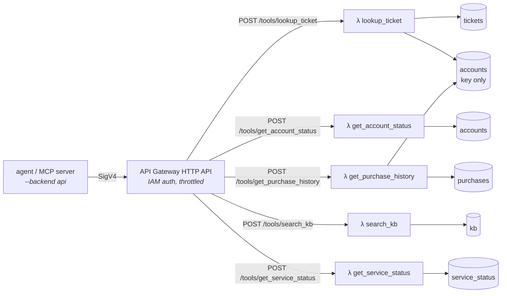

# AWS deployment

One CDK stack (`stack.py`) deploys the tool services:



- **DynamoDB:** five on-demand tables, one per entity, keyed by access pattern ([ADR-7](../docs/decisions.md)).
- **Lambda:** one function per tool, all built from the same package code. `TOOL` picks the tool, and each function has **its own IAM role** generated from [`access.py`](../src/support_agent/aws/access.py) ([ADR-8](../docs/decisions.md)).
- **API Gateway:** an HTTP API whose routes use the IAM authorizer. The `ClientPolicyArn` output grants `execute-api:Invoke` on these routes and nothing else.

## Monitoring

`monitoring.py` adds a CloudWatch dashboard (`<prefix>-operations`) and alarms that notify an SNS topic. Pass `-c alarm_email=you@example.com` on deploy to subscribe an email address.

| Scope | Source | Alarms |
|---|---|---|
| Each **skill** (discovered from `skills/` at synth time) | `SupportAgent` namespace, published by the agent with `--metrics` | error rate ≥ 10% over 15 min; p90 triage latency ≥ 30 s for 10 min |
| Each **tool** Lambda | `AWS/Lambda` | any errors (e.g. an IAM AccessDenied); any throttles |
| Tool **API** | `AWS/ApiGateway` | any 5xx; p90 latency ≥ 2 s for 10 min |

Adding a `SKILL.md` and redeploying gives the new skill its own dashboard lines and alarms, with no code changes. The `ClientPolicyArn` policy can publish metrics only to the `SupportAgent` namespace.

## Deploy

Prerequisites: the AWS CLI with credentials (`aws sts get-caller-identity` works), Node 18+ and uv.

```bash
cd infra
npx aws-cdk@2 bootstrap          # once per account/region
npx aws-cdk@2 deploy -c alarm_email=you@example.com   # prints ApiUrl, DashboardUrl, ...
cd ..
uv run --extra aws support-agent aws seed    # load data/ into the tables
```

Then run the agent against the deployed tools:

```bash
export SUPPORT_AGENT_API_URL=<ApiUrl output>
uv run --extra aws support-agent run --backend api --metrics "I was charged twice for 1000 Shards..."
uv run --extra aws support-agent run --backend dynamodb "..."   # direct to DynamoDB, no Lambdas
```

## Cost

Everything is pay-per-request with no idle cost apart from CloudWatch log storage. At demo volumes (a few hundred tool calls a day) the stack stays inside the free tier.

## Tear down

```bash
cd infra && npx aws-cdk@2 destroy   # tables and log groups are deleted too (demo data)
```

## Tests

`tests/test_infra.py` synthesizes the stack offline and asserts the security properties: a function per tool, IAM auth on every route, no wildcard DynamoDB actions, and attribute-restricted account reads. `tests/test_aws_access.py` records every DynamoDB call each tool makes under moto and checks each one against that tool's policy, in both directions.
